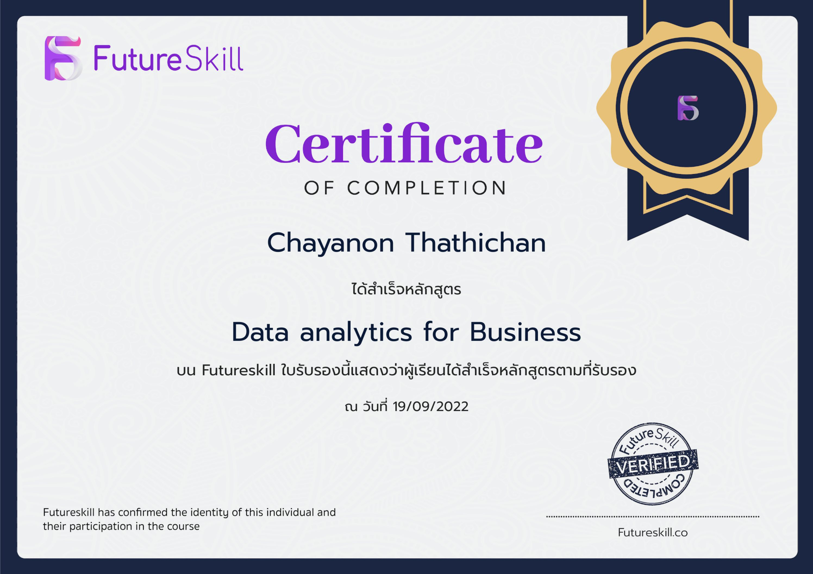

# Hi there! Welcome to my GitHub Profile! 👋
## ✨My name is Fight, I'm looking for Data Scientist or AI engineer job✨

    

📖 I am currently in my 4th year and will graduate in May 2023.Even though I didn't study IT directly, but I'm
interested in studying this field which I have studied online like YouTube Datacamp and Udemy.I am ready
to work under pressure and ready to learn new things from the advice of my colleagues. Also self-learned
and ready to practice regularly Finally, I want to be a part of the company in order to grow together in the
future.

📖 Now, I enjoy learning new technologies and new programming languages

## 🛠 Languages and Tools
⚡I have been learning and exploring these following tools and languages

 

  

## 🏆 Certificates 

    
   

    
     

   
      

<!--
**chayanondev/chayanondev** is a ✨ _special_ ✨ repository because its `README.md` (this file) appears on your GitHub profile.

Here are some ideas to get you started:

- 🔭 I’m currently working on ...
- 🌱 I’m currently learning ...
- 👯 I’m looking to collaborate on ...
- 🤔 I’m looking for help with ...
- 💬 Ask me about ...
- 📫 How to reach me: ...
- 😄 Pronouns: ...
- ⚡ Fun fact: ...
-->
